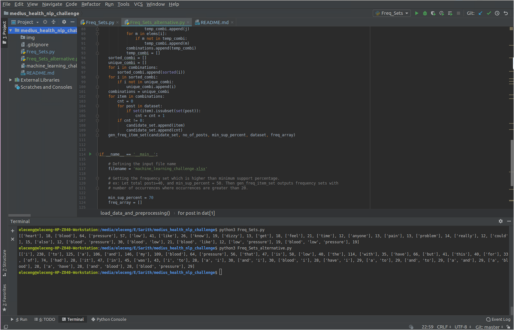

# PART: A
## Programming Challenge
The attached dataset contains two columns. First column is the topic of a post. Second column is the
text from the post. Using the given dataset, please write a native implementation for an algorithm to
discover the frequent text item-sets from the second column. Do not use any existing function or
library to achieve this objective (develop the algorithm code for frequent itemset mining and apply on
the dataset - do not use any brute force technique).

Hint: You can implement one of the Apriori, Eclat, or FP-growth techniques to achieve this (or a better
method)

## Solution
Implementation of Apriori algorithm to identify frequent text item-sets with minimum support. 
Algorithm only outputs the sets which is higher than minimum support and buit as a percentage.


##### Data preprocessing
Assuming that each raw represent a independent post,
* Posts are split into the words
* Split posts into words and get unique words from each post
* Stop words and punctuations are removed (Freq_Sets_alternative.py removes only punctuations)
* Running the Apriori algorithm.

##### How to run?  Implemented in python 3.6
Two variables defined inside the scripts,
* filename = 'machine_learning_challenge.xlsx'
* min_sup_percent = 30

According to the requirement change the minimum support percentage. e.g. Let total posts=40, and min_sup_percent = 50. Then gen_freq_item_set outputs frequency sets with
number of occurrences where occurrences are greater than 20.

There are two files,
* python Freq_Sets.py : Preprocessing is conducted using NLTK
* python Freq_Sets_alternative.py : Stop words are not removed. Removed only punctuations.

Therefore, frequency text set output from Freq_Sets_alternative.py is
 higher than Freq_Sets.py. Further improvements could be done to optimize the algorithm. Since given data is in .xlsx, 
 panda library used to read the file. If the file is in 'uni8' format like '.csv' following code could be used to read data.
 
```
 def load_csv(fname):
    """Load data from *.cvs
    """
    data = []
    with open(fname, 'r') as f:
        for line in f.readlines():
            items = line.strip('\n').split(',')
            data.append(items)
    return data
```

Since the task is to find only frequent text sets, conidance or mining rules haven't been 
implemented in the Apriori algorithm. 

## Test Results



## Reference
 Toivonen H. (2017) Apriori Algorithm. In: Sammut C., Webb G.I. (eds) Encyclopedia of Machine Learning and Data Mining. Springer, Boston, MA